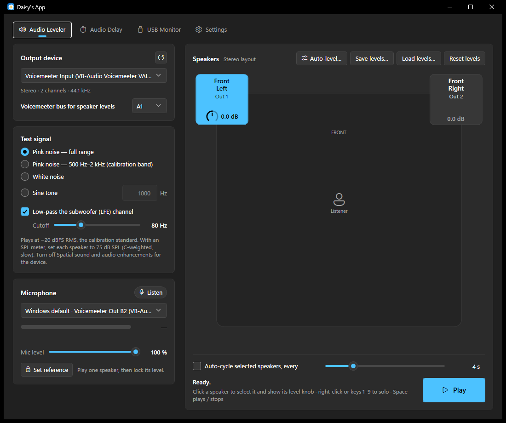

# Daisy's App

**Version 0.6.3** · [Download the latest release](https://github.com/rosscarlson/DaisysApp/releases/latest)

A tabbed Windows app that hosts small audio and hardware tools, called **applets**. Each applet is a tab and can be
switched on or off in Settings → General; **Settings** is always the last tab.



| Tab | What it does |
|---|---|
| Performance | Live graphs of CPU, GPU, memory, video memory, disk, network and temperatures, per-core load, processes and system details, with a log and history windows |
| USB Monitor | Real-time log of device connect / disconnect / status changes, with a per-launch log file |
| Audio Leveler | Test signals, per-speaker level knobs, microphone leveling and an auto-level wizard; levels stored in Voicemeeter's bus EQ (or Windows channel volume) |
| Audio Levels | A volume slider and mute for every playback and recording device, updating live (spot a device that got turned down) |
| Audio Delay | Brings two Voicemeeter outputs (e.g. a sound card and a Bluetooth speaker or VBAN stream) into sync with Voicemeeter's output delay |
| Resizer | Saved window sizes and positions per program (e.g. a game stretched over three monitors), applied by click, hotkey, tray, script or automatically (from Resize Rabbit) |
| Mini Mirror | Shows any part of the screen live in its own always-on-top window — a track map, delta bar or HUD corner moved to another monitor (from the MiniMirror SimHub plugin) |
| Settings | **General** (startup and tray, updates, applets on/off, theme, files), then a page for each applet that has settings |

---

## Contents

- [Install](#install)
- [Voicemeeter](#voicemeeter)
- [Performance](#performance)
- [USB Monitor](#usb-monitor)
- [Audio Leveler](#audio-leveler)
- [Audio Levels](#audio-levels)
- [Audio Delay](#audio-delay)
- [Resizer](#resizer)
- [Mini Mirror](#mini-mirror)
- [Settings](#settings)
- [Files and command line](#files-and-command-line)
- [Updates](#updates)
- [Version history](#version-history)
- [Project layout and adding an applet](#project-layout-and-adding-an-applet)
- [Build and release](#build-and-release)
- [Third-party](#third-party)

---

## Install

1. Download `DaisysApp-Setup-x.y.z.exe` from the [latest release](https://github.com/rosscarlson/DaisysApp/releases/latest).
2. Run it. Windows asks for admin approval, because the app installs to `C:\Program Files\Daisys App`.
   The installer isn't code-signed, so SmartScreen may warn: choose **More info → Run anyway**.
3. Start **Daisy's App** from the Start menu.

Everything the app needs is included (.NET doesn't have to be installed). Installing a newer version upgrades in
place. Uninstall from Settings → Apps → *Daisy's App*; that closes a running copy and removes the sign-in entry.

---

## Voicemeeter

The Audio Leveler and Audio Delay rely on **[Voicemeeter Banana or Potato](https://vb-audio.com/Voicemeeter/)**
(standard Voicemeeter lacks the per-channel bus EQ these tools use). A banner at the top of both tabs appears whenever
Voicemeeter isn't installed (**Get Voicemeeter**), isn't running (**Start Voicemeeter**), or is the standard edition;
it disappears by itself, and the tab refreshes, once Voicemeeter is up.

Everything the tools set — speaker levels and output delays — is stored **in Voicemeeter's own settings**, so it stays
applied whether or not Daisy's App is running. Save / Load buttons on both tabs keep a copy in a file too.

> **Why Voicemeeter?** Windows does have per-channel volume (Sound settings → device → Levels → Balance), and the
> Audio Leveler uses it for ordinary output devices. But Voicemeeter's virtual devices ignore it, and Voicemeeter
> usually drives the sound card in a way that bypasses it, so once audio goes through Voicemeeter, its per-channel EQ
> is the only place a level actually takes effect. Windows has no per-device delay at all.

---

## Audio Leveler

Plays a calibrated test signal on any speakers of the selected output device and lets you set each speaker's level,
by hand or automatically with a microphone.

**Speaker map.** Follows the speaker configuration Windows reports for the device (Stereo, Quad, 5.1, 7.1, 7.1.4 …;
numbered speakers if it isn't recognized). Each tile shows the speaker's full name, one word per line ("Front / Left",
"Low / Frequency / Effect"), and, for Voicemeeter devices, the bus channel it's on (**Out 1**, **Out 2** …, matching
Voicemeeter's own channel numbers). The map is a 5 × 5 grid with the listener in the middle: **drag a speaker to any
cell** to match where it really is in your room (e.g. the subwoofer between Front Left and Center, sides in the rear
corners); dropping it on another speaker swaps the two. Positions are saved for each output device. The grid size
(3 × 3 to 9 × 9) and **Reset speaker positions** are in Settings → Audio Leveler. To level all six speakers of a 5.1 system, the Windows device you play through
(e.g. *Voicemeeter Input*) must be set to 5.1 in Sound settings → *Configure*.

**Signals.** Pink noise (full range), pink noise 500 Hz–2 kHz (calibration band), white noise, sine 10 Hz–20 kHz. All
play at −20 dBFS RMS (the calibration standard) and are RMS-normalized. The subwoofer (LFE) channel can be low-passed
at 24 dB/octave (30–200 Hz, default 80 Hz).

**Level knobs.** Select a speaker and a knob appears on its tile:
- **Voicemeeter devices:** the level is set in the EQ of the bus you pick under *Output device* (±12 dB). Each bus has
  an 8-channel parametric EQ; the app uses **cells 5 and 6** of a speaker's channel as a low shelf and a high shelf at
  1 kHz with the same gain, which together are a flat volume change. See them in Voicemeeter: right-click the bus's
  **EQ** button. Setting a level turns the bus EQ on; if that bus's EQ was off but has other bands set up, the app
  warns you. This is separate from VB-Audio's 8x8 Matrix (which only works while the Matrix runs); don't level the
  same speakers with both.
- **Other devices:** the level is the Windows per-channel volume (−40 to 0 dB).

**Microphone.** Chosen in the Level Wizard, which shows its live level and **Mic level** (the mic's Windows input
volume; lower it if the meter shows CLIPPING). The Windows default mic is marked **Windows default ·** and is chosen
on first run; any other mic you pick is remembered.

**Load / Save / Reset levels** (the three icon buttons next to **Level Wizard**; hover for their names). Save and
Load write every speaker's level to a `*.levels.json` file (by default in
`Documents\Daisy's App`) and set them again from it — handy after resetting Voicemeeter. Levels are matched by channel;
the app tells you if the file came from another device or if a speaker's name has changed.

### Leveling

Before you start: set the device's speaker configuration in Windows, turn off Spatial sound and enhancements, and put
the mic or SPL meter at the listening position, at ear height, pointing at the ceiling.

- **With an SPL meter:** choose *Pink noise — 500 Hz–2 kHz*, solo a speaker, press Play, and turn its knob until the
  meter reads your target (typically 75 dB SPL, C-weighted, slow). Repeat; Auto-cycle steps through them for you.
- **With a mic:** press **Level Wizard**, pick the microphone, tick the speakers, and press **Start**.
  - All ticked speakers start from the same level. The wizard measures the room's background noise, then plays
    band-limited pink noise on each speaker for 2 seconds, showing the live mic reading in that speaker's row.
  - **Baseline** (pass 1): the softest speaker becomes the baseline and the others are turned down to match. No
    speaker is cut by more than 10 dB: if one would need more, all speakers are raised by the difference instead,
    keeping them balanced within ±12 dB. **Leveling** (pass 2) checks every speaker and corrects; **Verifying**
    (pass 3) runs only if one is still more than 0.5 dB out. **Level** shows each speaker's setting.
  - A subwoofer that's too quiet to measure, more than 10 dB quieter than the other speakers, or still unbalanced
    after pass 3 is left out and set back to 0 dB; the result says it may need more power.
  - If the mic clips, its level is lowered by 6 dB and the run starts over (up to six times). Esc or Cancel puts the
    original levels back. It stops with a message if a speaker isn't 10 dB above the noise, or if a level change made
    no measurable difference (usually the wrong Voicemeeter bus).

Mic readings are relative (dB at the mic), not calibrated SPL.

| Action | How |
|---|---|
| Play / stop | Space or the Play button |
| Select / deselect a speaker | Click its tile |
| Solo a speaker | Right-click its tile, or keys 1–9 |
| Adjust a level | Drag the knob up/down (Shift = fine) or scroll (0.5 dB; Shift = 0.1 dB); double-click = 0 dB |
| Move a speaker on the map | Drag its tile to another cell (onto another speaker to swap) |
| Reset all levels | Reset levels (the ↺ icon), then click again to confirm |

| Problem | Fix |
|---|---|
| Only two speakers on a 5.1 system | Set the playback device (e.g. *Voicemeeter Input*) to 5.1 in Windows Sound settings → *Configure*, then press refresh. |
| Knobs don't change what you hear (Voicemeeter) | Check the bus under *Output device* is the one your speakers are on. |
| Knobs don't change what you hear (other device) | Some drivers ignore per-channel volume; use the physical output device. |
| "Windows blocked microphone access" | Settings → Privacy & security → Microphone → *Let desktop apps access your microphone*. |
| Mic shows CLIPPING | Lower **Mic level**, or turn the speakers down. |
| "Couldn't hear … above the background noise" | Raise the mic level or speaker volume, move the mic closer, or quiet the room. |

---

## Audio Levels

Every connected playback and recording device with its Windows volume (0–100, the same number as Sound settings) and a
mute button. The default devices are listed first, marked **Default ·**. The sliders follow the devices live: if
something turns a device down (a Bluetooth headset or speaker resetting its volume, another app, the device's own
buttons) the slider moves, so you can see it and put it back. Drag a slider or scroll over it (Shift = 1 at a time).
Devices appear and disappear as they're connected; the refresh button looks again.

---

## Audio Delay

For two outputs that play the same audio but reach you at different times — typically a sound card and a Bluetooth
speaker, or a VBAN stream to another PC, which lag. Choose the two Voicemeeter outputs, the device to play through
(usually *Voicemeeter Input*, whose strip must be routed to both outputs) and a microphone at your listening position,
then press **Start**.

- **Device 1 is the base** and keeps no delay; **Device 2 gets the delay**. If the baseline shows Device 2 is actually
  the later one, the app says so, swaps the two selections and carries on.
- Outputs can be hardware (A1 …) or virtual (B1 …, e.g. sent on over VBAN). Voicemeeter can only delay hardware
  outputs, so a virtual output can be the base but never the delayed one. For a VBAN stream that lags, make it
  Device 1 and the sound card (A1) Device 2.
- It plays a short beep (a 30 ms sweep) on each output in turn, three times each, and times when each reaches the mic,
  so it knows which one is late without any guessing. For each beep the other hardware outputs (and the other selected
  output) are muted in Voicemeeter.
- The delay is Voicemeeter's **output delay** (Menu → System Settings, 0–500 ms). Only one output is ever delayed, to
  keep audio as close to the video as possible.
- **Baseline** measures how far apart they are, **Adjusting** checks after setting the delay, and **Verifying** runs
  only if they're still more than 1 ms apart.
- Mutes are always put back afterwards; Cancel (Esc) or an error also puts the delays back. If the mic clips, its level
  is lowered and the run starts over. **Reset delays** sets the hardware outputs back to 0 ms.
- **Save delays… / Load delays…** write every hardware output's delay to a `*.delays.json` file (by default in
  `Documents\Daisy's App`) and set them again from it, matched by output name (A1, A2 …).
- **Microphones that come through Voicemeeter** (e.g. *Voicemeeter Out B2*) work: that bus is never muted, and if the
  playback strip also feeds it, that route is switched off during the test (and restored) so the beep can't reach the
  "mic" electronically. The mic's bus can't be one of the two outputs being synced. For headphones, hold an earcup
  against the mic.

---

## USB Monitor

Logs device connect/disconnect activity in real time, including devices that fail to enumerate ("Unknown USB Device
(Device Descriptor Request Failed)"). It runs for as long as the app does, whichever tab is open and while the window
is hidden in the tray.

- New events appear at the top; click a column header to sort, drag a header edge to resize. **Event** says
  Connected, Disconnected or Status changed; **Status** (third column) is the device's own state (OK, or a problem code
  such as Code 43). Double-click a row for every property that could be read, on one page, with copy buttons.
- A disconnected device shows the identity it had when it connected (details are cached when first seen). Missing
  fields are left blank; an event is never dropped.
- **Log file:** `%LOCALAPPDATA%\DaisysApp\logs\usbmon_<yyyy-MM-dd_HHmmss>.log`, tab-delimited, one per launch, flushed
  on every event. Turn it off in Settings → USB Monitor.

**How detection works** — three layers, so a flaky device is caught however badly it misbehaves:

1. A hidden top-level window registers for device-interface arrival/removal (`RegisterDeviceNotification`, all
   interface classes — so an occasional non-USB device, such as a Bluetooth pairing, can also appear).
2. On `DBT_DEVNODES_CHANGED` (debounced ~400 ms) the USB device tree is snapshotted through SetupAPI/CfgMgr32 and
   diffed against the previous snapshot. This path is USB-only and catches devices that never register an interface.
3. The same diff runs every 3 seconds regardless, so a missed notification can't hide a plug/unplug.

Events are de-duplicated (same device and transition within ~1.5 s), though one physical plug can still produce
several rows: a hub, its composite parent and each child interface.

---

## Resizer

Saves a window size and position for a program and puts its window there on demand — typically to stretch a game
across several monitors without Nvidia Surround / Eyefinity, or to force a size the game doesn't offer. Ported from
[Resize Rabbit](https://github.com/rosscarlson/resize-rabbit) (itself based on Resize Raccoon by mistenkt).

**Profiles.** **New profile** opens the editor:
- **Program** — pick a running program (tick *Show all processes* to see ones without a window) or type its exe name.
- **Window** — width, height and position in pixels, measured from the top-left of the main display (screens to its
  left are negative). Leave width and height empty to only move the window. **Copy from a preset** fills in triple
  1080p / 1440p / 4K; **Use current window** fills in the program's window as it is now.
- **Remove borders** strips the window frame; **Remove title bar (Store / UWP games)** also moves the leftover title
  strip of games like Forza Horizon 4 above the screen (does nothing for other games).
- **Apply automatically when the program starts**, with an optional wait, and a **Shortcut**.
- **Apply now** tries the values without saving.

**Groups.** **New group** creates one; a profile joins it from the editor's **Group** list. A group's shortcut (and its
apply button) applies every member whose program is running. Groups and profiles are ordered with the ↑ / ↓ buttons.

**Applying.** A green dot marks profiles whose program is running. A profile is applied by its apply button, its
shortcut (system-wide, also with the app in the tray), the tray icon's **Resizer** menu, a script or Stream Deck
command, or automatically when the **process watcher** (Resizer tab) is on. Several profiles can share a shortcut: it
applies whichever of their programs are running.

```
echo apply-profile "Profile name" > \\.\pipe\resize-rabbit
echo apply-group "Group name" > \\.\pipe\resize-rabbit
echo show > \\.\pipe\resize-rabbit
```

The pipe has Resize Rabbit's name so existing scripts keep working (`\\.\pipe\daisysapp-resizer` also works).

**How applying works.** The program's largest visible window is used (a program can own several); if no process has
the exe name, a window whose title contains the profile name is tried (some games' windows belong to a differently
named process). The window is moved and checked; if the program has no window yet it tries again every 5 s (twice),
and for ~35 s afterwards it re-applies if the game moves itself back. A program running as administrator can only be
moved if Daisy's App runs as administrator too.

**Moving from Resize Rabbit.** On first run the Resizer imports Resize Rabbit's profiles, groups and watcher setting
from this PC; Settings → Resizer can import again (or from Resize Raccoon). While Resize Rabbit is still running it
keeps its shortcuts and the pipe, so close it (and stop it starting with Windows) once your profiles are here.

---

## Mini Mirror

Draw a rectangle or circle around any part of the screen and see it live in its own borderless, always-on-top window
that you can put anywhere — a game's track map, delta bar or a corner of its HUD on another monitor, a companion app
next to the game, and so on. Ported from the [MiniMirror SimHub plugin](https://github.com/rosscarlson/SimHub-MiniMirror);
it no longer needs SimHub.

**Making a mirror.** Press **Ctrl+Shift+F8** from anywhere — in a game, it stays in front and keeps the focus, so it
doesn't pause — or **New mirror** (or **New mirror…** in the tray icon's Mini Mirror menu), which gets Daisy's App out
of the way. Every screen dims; drag around what you want to mirror — the drag can cross monitors. Press **R** or
**C** (before or during the drag) for a rectangle or a circle. The outline can still be moved and resized; then press
**Confirm** or Enter (**Cancel** or Esc backs out). The mirror appears on top of the region; drag it where you want it.

**The mirror window.** Drag it to move it, drag an edge or corner to resize it. Hold **Alt** while dragging to snap its
edges to other mirrors' edges, to line up a row or column. Mirrors aren't in the taskbar or Alt+Tab.

**Settings for each mirror** (pick it in the list on the Mini Mirror tab):

| Setting | What it does |
|---|---|
| Name | Shown in the list and the tray menu |
| Re-select region | Drag around a new area for this mirror |
| Duplicate | Copies the mirror and all its settings (except the shortcut) into a new one, slightly offset |
| Delete | Click twice to confirm |
| Show this mirror | Shows / hides it (also its shortcut, the tray menu, **Show all** / **Hide all**) |
| Shape | Rectangle, or a circle cut out of the region |
| Window size | The window's size relative to the region (0.1× – 5×); double-click the slider for 1× |
| Zoom | Magnifies the middle of the region (up to 8×) or takes in more around it (down to 0.2×), without changing the window size |
| Opacity | 10 – 100 % |
| Frame rate | New mirrors start at their monitor's refresh rate (e.g. 120 / 144 Hz); lower it to save CPU |
| Lock position | Stops it being moved or resized by accident |
| Click-through | Clicks go to whatever is underneath |
| Keep proportions | Corner drags keep the window's shape |
| Show / hide shortcut | A key combination (with Ctrl, Alt or Shift) **or a wheel / button box / controller button**, working system-wide, also in games. Mirrors sharing a shortcut toggle together |

**Settings → Mini Mirror:**
- **New mirror shortcut** — Ctrl+Shift+F8 by default; any key combination or a wheel / controller button. While a
  region is being picked, Esc, Enter, R, C and Tab are taken over system-wide (the game keeps the focus, so the keys
  can't go through it), and handed back when it's done.
- **Convert HDR monitors to SDR** (on) — with Windows HDR on, a plain capture of the desktop looks washed out. Mini
  Mirror asks Windows for the HDR picture and converts it on the GPU the way Windows shows SDR content, using the
  monitor's *SDR content brightness* (Settings → Display → HDR), so an SDR game in a mirror looks like the game.
  Very bright HDR highlights are clipped.
- **Hide mirrors from screenshots, recordings and streams** — mirrors are left out of screen captures (needs Windows 10
  2004 or later). This also stops a mirror sitting over the area it mirrors from showing itself over and over. Leave it
  off if you want mirrors in a whole-screen OBS capture.
- **Import mirrors from the SimHub plugin** — copies the mirrors made in SimHub (from
  `<SimHub>\PluginsData\Common\MiniMirrorSettings.json`, which SimHub writes when it closes). SimHub hotkeys can't come
  across, so set shortcuts again. Remove the plugin from SimHub afterwards so you don't get two of each mirror.

**How it works.** Each monitor is captured with DXGI Desktop Duplication (one capture per monitor, shared by all its
mirrors, started only while a mirror needs it, and skipping frames where nothing changed). Each mirror composes its
region (cropped by zoom) at its own frame rate and draws it into its window. Everything is in physical pixels, so
mixed-DPI monitor setups line up. A mirror whose monitor is unplugged is moved back onto a screen.

**Limits.** Controller buttons use the classic Windows joystick interface: up to 16 controllers and buttons 1–32 each.
Content Windows protects from capture (some video players, or apps that exclude themselves) shows as black. A
full-screen *exclusive* game can't be captured — use borderless / windowed full screen.

---

## Performance

The PC's performance at a glance, with history.

**Tiles** (each with a 2-minute live graph; **click one for its history**):

| Tile | Shows |
|---|---|
| CPU | Load (as Task Manager counts it), clock speed, number of processes and threads |
| GPU | Load, clock, power, model |
| Memory | Use, GB in use of installed, committed memory |
| Video memory | Use, GB in use of the card's total |
| Disk | Active time of the busiest disk (and which one), read and write speed of all disks together |
| Network | Download and upload speed (all adapters) |
| Temperatures | CPU and GPU temperature (the hotter one in big), CPU and GPU power, GPU fan |
| CPU cores | A bar per logical processor |

**Hardware sensors** (with LibreHardwareMonitor, below): every sensor it reports, grouped by hardware — motherboard,
CPU, each memory module, graphics card, each drive — with its value now and its minimum and maximum, filtered by kind
(Temperatures, Fans, Power, Voltages, Clocks, Load, Other). Click a sensor for its history, or a hardware name for all
its sensors of that kind on one graph. Without LibreHardwareMonitor a banner at the top offers **Get more sensor
data…**, which explains how to set it up and checks for it while it's open.

**Warnings.** A tile turns **orange** or **red** when it's over its warning levels (judged on a 3-second average, so a
single spike doesn't): CPU 80 / 95 %, busiest CPU core 90 / 98 %, GPU 90 / 98 %, memory 80 / 90 %, video memory 85 /
95 %, busiest disk 80 / 95 %, download 400 / 800 and upload 200 / 400 Mbit/s, CPU temperature 80 / 90 °C, GPU
temperature 80 / 88 °C. Each history window's **Warnings** button changes its levels, and its graphs show them as
dashed lines. In the process list, a process over its levels is highlighted orange or red (CPU 25 / 50 %, RAM 4 / 8 GB,
GPU 80 / 95 %, VRAM 4 / 8 GB, disk 100 / 300 MB/s); the **gear** next to the search box sets those and how often the
list refreshes (0.5 to 5 seconds, 1 by default).

Below: the **process** list — **Apps** (programs with a window) first, then **Background processes**, like Task
Manager — with CPU, RAM (private memory), GPU, **GPU engine** (which graphics card and engine it's using, e.g. "GPU 0 -
3D"), VRAM, disk/network I/O and threads; sortable, live, searchable; **double-click a process for its graphs**. Beside
it **Storage** (each drive's free space) and **System** (processor, cores, memory, graphics card and driver, Windows
version, uptime).

**History windows** show the last 10 minutes live (a reading a second), or the last hour, 6 hours, 24 hours, 7 days,
30 days, today, yesterday or any logged day. Hover over a graph to read its values; click a name in a graph's legend
to highlight that line in white (click again for all); **Show peaks** adds the highest value of each period as a faint
line. Related lines share a graph (CPU and GPU temperature; CPU and GPU power). The summary stays at the bottom while
the graphs scroll. Each window has a summary (lowest, average, highest, and the value it stayed
under 95% of the time), the CPU and Memory windows list the busiest processes over the period (double-click for that
process's history), and **Export…** saves the numbers as a CSV file.

**The log.** While Daisy's App runs (also in the tray) it records, every 10 seconds, the average and peak of every
graph plus the 5 busiest processes by CPU and by memory: about 1 MB a day in
`%LOCALAPPDATA%\DaisysApp\logs\performance`. With LibreHardwareMonitor, its temperatures, fans and power are logged
the same way (`sensors-<date>.csv`, a few MB a day); voltages, clocks and loads are live only. Settings → Performance
turns the log off, sets how long it's kept (7 days to a
year, 30 by default), opens the folder or deletes it.

**Where the numbers come from.** Windows' performance counters (the same as Task Manager and Performance Monitor);
NVIDIA's driver for the GPU's load, clock, power, fan, temperature and memory (other graphics cards get load and
memory from Windows, without temperature or power); and **LibreHardwareMonitor** for everything else. Windows doesn't
give programs the CPU's, motherboard's or fans' sensors without a driver; LibreHardwareMonitor has one. Run it with its
web server on (Options → Remote Web Server → Run, port 8085 — the same server Zabbix and similar tools read) and the
CPU appears on the Temperatures tile, the Hardware sensors section appears, and both go in the log. A different
address can be set in Settings → Performance. For graphics cards other than NVIDIA, the GPU's temperature, power and
fan come from LibreHardwareMonitor too.
Memory and disk sizes are in GB as Windows counts them (1 GB = 1024³ bytes).

---

## Settings

**General** (first):
- **Startup and system tray** — keep running in the tray when the window is closed (on by default; right-click the
  tray icon to exit), start when you sign in to Windows, and start hidden in the tray.
- **Updates** — the installed version, check for updates when the app starts, **Check for updates** and
  **Release notes**.
- **Applets** — every applet the app contains, each with an on/off checkbox and a one-line description. A switched-off
  applet isn't loaded at all (no tab, no settings page, nothing running in the background); its settings are kept for
  when it's switched back on. Changes apply after a restart: **Restart now** appears when there's one to apply.
- **Appearance** — Dark (default), Light, or System theme.
- **Files** — open the settings and logs folders.

Then a page for each enabled applet that has settings: **Audio Leveler** (turn Voicemeeter EQ levels on/off),
**USB Monitor** (log file on/off, open the log folder), **Resizer** (process watcher speed, import from Resize
Rabbit / Raccoon), **Mini Mirror** (new-mirror shortcut, HDR, hide from screen capture, import from the SimHub
plugin) and **Performance** (the log; LibreHardwareMonitor's address and setup guide).

---

## Files and command line

| Item | Location |
|---|---|
| Program | `C:\Program Files\Daisys App\DaisysApp.exe` |
| Settings | `%APPDATA%\DaisysApp\` — `settings.json` (app), `AudioLevel.json`, `AudioDelay.json`, `UsbMonitor.json`, `Resizer.json` (profiles and groups), `MiniMirror.json` (mirrors) |
| Saved levels and delays | `Documents\Daisy's App\` by default (`*.levels.json`, `*.delays.json`) |
| Logs | `%LOCALAPPDATA%\DaisysApp\logs\` (USB events, `errors.log`, `performance\` for the Performance log) |
| Start at sign-in | `HKCU\Software\Microsoft\Windows\CurrentVersion\Run` → `DaisysApp` |
| Update downloads | `%TEMP%\DaisysApp-Update\` |

On first run the Audio Leveler and USB Monitor import settings from the standalone MCAL and USB Mon apps they came from.

| Argument | Effect |
|---|---|
| *(none)* | Start, or bring the running copy to the front (only one copy runs) |
| `--tray` | Start hidden in the tray (used by start at sign-in) |
| `--exit` | Ask the running copy to exit cleanly (used by the uninstaller) |
| `--restart` | Wait for the running copy to close, then start (used by **Restart now**) |

---

## Updates

On launch (if enabled) and from **Check for updates** (Settings → General, or the tray menu) the app reads the latest
[GitHub release](https://github.com/rosscarlson/DaisysApp/releases). When it's newer, a banner offers **What's new**
and **Install update**; nothing installs until you click. The installer is downloaded, checked against the SHA-256
GitHub publishes for it, run silently (Windows asks for admin approval), and the app restarts on the new version.

---

## Version history

**0.6.3**
- Performance is the first tab and USB Monitor the second.

**0.6.2**
- Performance: warning levels — tiles turn orange / red, over-limit processes are highlighted, levels set from each
  history window's **Warnings** button and the process list's gear (with the list's refresh rate, down to 0.5 s);
  levels drawn on the graphs; CPU cores tile moved to the start of the second row; legends back on the graph's title
  line; process groups indented; fixed the process list not keeping its sort order (it looked frozen).

**0.6.1**
- Performance: processes split into Apps and Background processes; RAM / VRAM columns; GPU engine column; centred
  headers; Storage above System; the Disk tile shows the busiest disk (an average over all disks hid one disk being
  flat out); history windows: clickable legend highlights a line, CPU and GPU power on one graph, the summary always
  in view, a Close button.
- Performance: every LibreHardwareMonitor sensor in a **Hardware sensors** section (grouped by hardware, filtered by
  kind, value / min / max, history per sensor or per piece of hardware); temperatures, fans and power logged; a **Get
  more sensor data…** banner and setup guide when it isn't running; its address in Settings → Performance.

**0.6.0**
- New **Performance** applet: live tiles for CPU, GPU, memory, video memory, disk, network, temperatures and CPU
  cores; process list; system and storage details; a background log with history windows (date ranges, peaks,
  summary, busiest processes, CSV export); CPU temperature from LibreHardwareMonitor, GPU sensors from NVIDIA's driver.
- Mini Mirror: fixed an error that could appear while picking a region.

**0.5.0**
- New **Audio Levels** applet: a live volume slider and mute for every playback and recording device.

**0.4.0**
- Audio Leveler: the speaker map is a grid (5 × 5 by default, set in Settings → Audio Leveler) and speakers can be
  dragged anywhere on it to match the room, saved per device; the microphone is chosen in the wizard (the Microphone
  card is gone from the page); **Auto-level…** is now **Level Wizard**; Load / Save / Reset levels are icon buttons.
- Mini Mirror: **Ctrl+Shift+F8** starts a new mirror without leaving the game (the selection never takes the focus,
  so games don't pause); HDR monitors are converted to SDR so mirrors aren't washed out.
- The window title shows the version (Daisy's App v0.4).
- Global shortcuts no longer use a hidden window (which could take the focus from a game).

**0.3.0**
- New **Resizer** applet, ported from Resize Rabbit: window size/position profiles and groups, global shortcuts,
  tray menu, script / Stream Deck pipe (same name as Resize Rabbit's), process watcher, import from Resize Rabbit and
  Resize Raccoon.
- New **Mini Mirror** applet, ported from the MiniMirror SimHub plugin (no SimHub needed): live always-on-top mirrors of
  any screen region (rectangle or circle, across monitors), window size and zoom, opacity, frame rate, lock,
  click-through, duplicate, Alt-drag snapping, show / hide shortcuts that can be a keyboard combination or a wheel /
  controller button, tray menu, optional hiding from screen capture, import from the SimHub plugin.
- Applets can add their own submenu to the tray icon's menu.
- Global shortcut handling (and the shortcut box, now with controller buttons) moved to `Shared/Hotkeys/`.

**0.2.2**
- Applets: each applet lives in its own folder under `src/DaisysApp/Applets/`, is found automatically, and can be
  switched on or off in Settings → General → **Applets** (with **Restart now**). Code shared between applets moved to
  `src/DaisysApp/Shared/`.

**0.2.1**
- Settings: **General** is the first page, with **Updates** second; tool pages follow in tab order.
- Audio Leveler: **Save levels… / Load levels…**.
- Audio Delay: **Save delays… / Load delays…**.

**0.2.0** — first release of the combined app
- Shell: tabs (Audio Leveler, Audio Delay, USB Monitor, Settings), system tray, start at sign-in, dark/light/system
  theme, GitHub auto-update.
- Audio Leveler (from MCAL): levels stored in Voicemeeter's bus EQ (persist without the app), auto-level wizard
  (Baseline / Leveling / Verifying, 10 dB cut cap, subwoofer handling, live readings, mic clipping recovery), mic level
  control, full speaker names with Voicemeeter **Out** channels, Voicemeeter check banner.
- Audio Delay (new): syncs two Voicemeeter outputs with output delay, including virtual/VBAN outputs.
- USB Monitor (from USB Mon): newest first, Status column third, Connected/Disconnected, one-page device details,
  resizable columns.

---

## Project layout and adding an applet

```
src/DaisysApp/
  App.xaml(.cs), MainWindow.xaml(.cs)   shell: startup, single instance, tabs, update banner, tray, restart
  Shell/      IApplet + [Applet] + AppletCatalog (applet discovery), SettingsPage, TabStrip, TrayIcon
  Settings/   AppSettings (settings.json), JsonStore (one JSON file per applet), StartupManager
  Theming/, Themes/   Dark/Light palettes and control styles (design.md)
  Updates/    GitHub Releases check, verified download, installer launch
  Logging/    errors.log
  Shared/     code used by more than one applet
    Audio/          DeviceService (playback/capture devices), SpeakerLayout, MicGain (Windows mic volume)
    Voicemeeter/    VoicemeeterRemote (Remote API), VoicemeeterBanner (installed/running check)
    Hotkeys/        HotkeyManager (system-wide shortcuts), ControllerButtons (wheel / controller buttons), ShortcutBox
  Applets/    one folder per applet, nothing shared between them
    AudioLevel/     AudioLevelApplet + view, auto-level wizard, signals, mic meter, Voicemeeter EQ levels
    AudioLevels/    AudioLevelsApplet + view, a live Windows volume row per device
    AudioDelay/     AudioDelayApplet + view, beep player, mic recorder, arrival-time analysis
    UsbMonitor/     UsbMonitorApplet + view, device capture, event log, details window
    Resizer/        ResizerApplet + view, editors, window mover, script pipe, process watcher
    MiniMirror/     MiniMirrorApplet + view, screen capture, compositor, mirror windows, region selection
    Performance/    PerformanceApplet + view, sampler (PDH counters, NVML, LibreHardwareMonitor), log, graphs, history
```

To add an applet:

1. Create a folder `src/DaisysApp/Applets/<Name>/` and put all of its code there (namespace `DaisysApp.Applets.<Name>`).
2. Add a class that implements `Shell/IApplet` (its tab content, an optional settings page, start/save/dispose, and
   optionally a tray submenu) and tag it with its metadata:
   ```csharp
   [Applet("MyThing", "My Thing", "", Order = 40, Description = "One line for Settings → Applets")]
   public sealed class MyThingApplet : IApplet { … }
   ```
   `Order` is the tab position; the Id is the stable key for its settings file (`%APPDATA%\DaisysApp\MyThing.json`
   via `Settings/JsonStore`) and its on/off setting.

That's all: the app finds it automatically, gives it a tab and a Settings page, and lists it under Settings → General
→ Applets. If two applets need the same code, it goes in `Shared/`, never in another applet's folder. The UI follows
the design system in `design.md` (styles in `Themes/Controls.xaml`).

## Build and release

Requires the .NET 8 SDK and Inno Setup 6 (`winget install JRSoftware.InnoSetup`).

```powershell
dotnet build src\DaisysApp\DaisysApp.csproj
.\build.ps1                 # -> artifacts\DaisysApp-Setup-<version>.exe
```

To release: bump `<Version>` in `src/DaisysApp/DaisysApp.csproj` (and the version at the top of this file), commit,
then tag and push, e.g. `git tag v0.6.3; git push origin v0.6.3`. The Release workflow builds the installer on GitHub
and publishes the release that installed copies update from. CI builds every push to `main`.

## Third-party

[NAudio](https://github.com/naudio/NAudio) (MIT), [LibreHardwareMonitor](https://github.com/LibreHardwareMonitor/LibreHardwareMonitor) (read over its web server if you run it; not included), [Vortice.Windows](https://github.com/amerkoleci/Vortice.Windows) (MIT, Mini Mirror's screen capture), .NET 8 runtime (bundled), Inno Setup (installer). The Resizer is ported
from [Resize Rabbit](https://github.com/rosscarlson/resize-rabbit) and [Resize Raccoon](https://github.com/mistenkt/resize-raccoon)
by mistenkt (MIT). Voicemeeter and
its Remote API are VB-Audio's (installed separately, not shipped).
